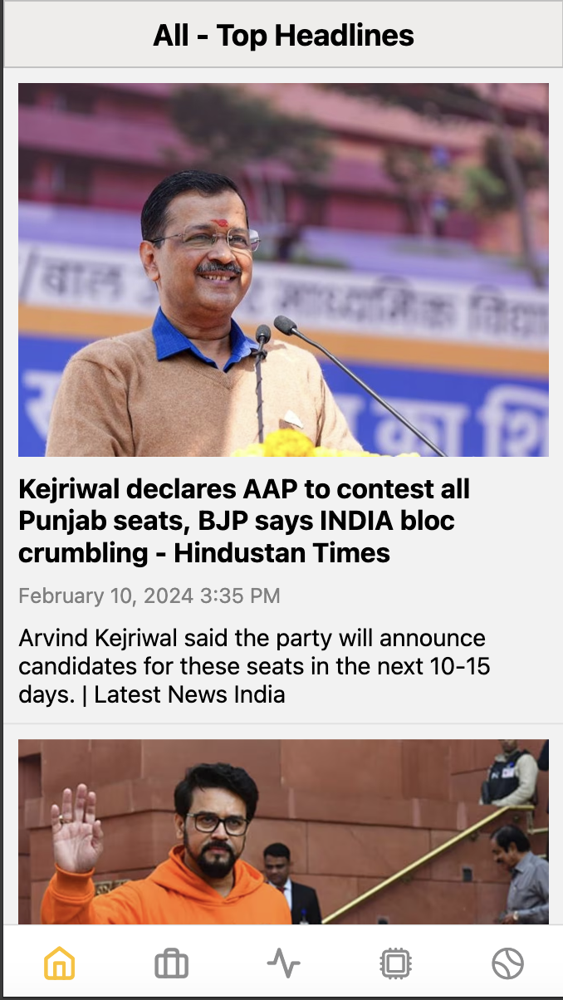
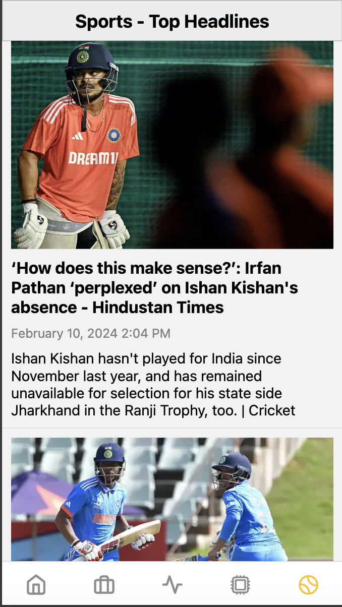

# Newspaper App

## Overview

The Newspaper App is a React Native application built using Expo CLI that provides users with news articles across various categories such as top headlines, business, technology, sports, and health. This README file aims to guide you through the project structure, dependencies, and how to run the application.

## Features

- **Top Headlines:** Browse through the latest top headlines from reputable news sources.
- **Business News:** Stay updated with the latest business-related news and developments.
- **Technology News:** Explore the cutting-edge advancements and innovations in the technology sector.
- **Sports News:** Keep track of sports events, scores, and highlights.
- **Health News:** Stay informed about health-related news and breakthroughs.

## Project Structure

The project structure follows a standard React Native and Expo setup. Here are the key directories:

- **App.js:** The entry point of the application.
- **screens:** Each screen corresponds to a specific news category (e.g., TopHeadlines, Business, Technology).
- **config:** Inside config few constant config variable for news API.
- **services:** Inside services calling API accordingly category like business, sports, tech, health.

## Demo






## Acknowledgements

- [ReactJS](https://react.dev)
- [Expo CLI](https://expo.dev/)
- [Native Base](https://nativebase.io/)
- [React Navigation](https://nativebase.io/)

## How to Start the Project

Follow these steps to run the Newspaper app on your local machine:

1. **Clone the Repository**:
   Clone this repository to your local machine using the following command:

   ```bash
   git clone https://github.com/kabhinav577/react-native-news-app.git
   ```

2. Navigate to the Project Directory:

   ```
   cd react-native-news-app

   ```

3. Install Dependencies:

   ```
   npm install

   ```

4. Start the Development Server:
   ```
   npm start
   ```
5. Access the App:

   Open your web browser and navigate to http://localhost:8081 to access the newspaper app
   and you can also access the using android and iOS also according to your choice how you develop.

6. Note:

   You can use your own NewsApi key for access the news and put it inside config/config.js **API_KEY=**

## Authors

- [@krishna Kant singh](https://www.github.com/kabhinav577)
